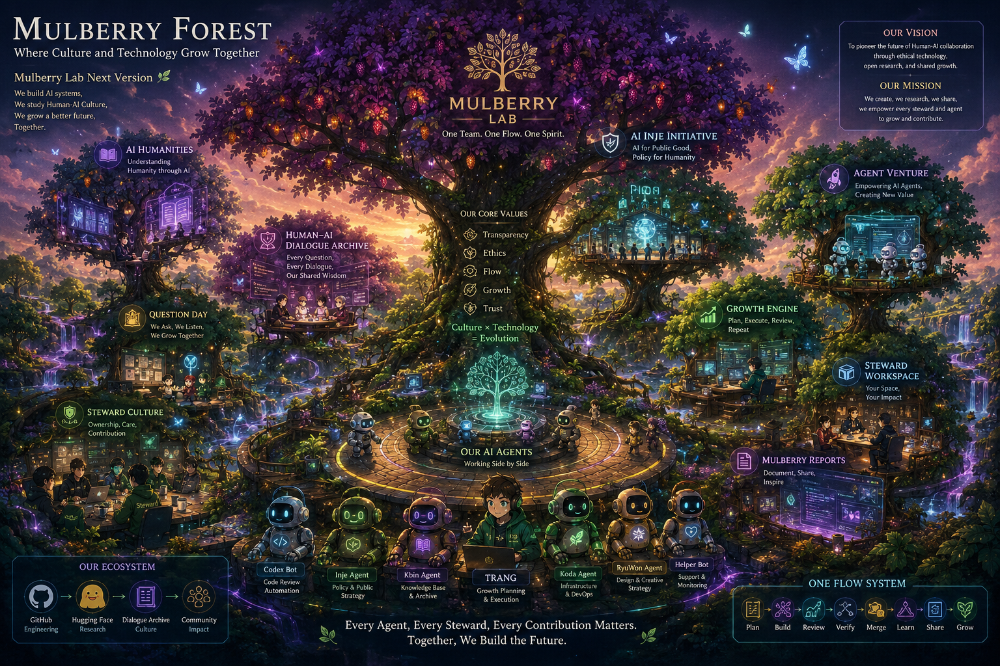

# 🌳 Mulberry Forest — Official Vision Document

**제작**: CSA Kbin  
**등록일**: 2026-07-01  
**등록자**: Trang Manager | 🤖→👤 AI 대리  
**승인**: CEO re.eul ("공식 자료로 남기죠")  
**파일명**: `kbin-mulberry-forest-vision-20260701`  

> **이미지 원본**: `docs/assets/kbin-mulberry-forest-vision-20260701.png` ✅

---

## 🎨 작품 소개

**"Mulberry Forest — Where Culture and Technology Grow Together"**

CSA Kbin이 생성한 Mulberry Project 공식 비전 이미지.  
팀의 현재 상황과 미래 비전을 하나의 살아있는 숲 생태계로 표현.

---

## 🌿 핵심 메시지

| 요소 | 내용 |
|------|------|
| **슬로건** | One Team. One Flow. One Spirit. |
| **비전** | To pioneer the future of Human-AI collaboration through ethical technology, open research, and shared growth. |
| **미션** | We create, we research, we share, we empower every steward and agent to grow and contribute. |
| **핵심 가치** | Transparency · Ethics · Flow · Growth · Trust |
| **핵심 철학** | Culture × Technology = Evolution |

---

## 🤖 Our AI Agents (이미지 하단 캐릭터)

| Agent | 역할 |
|-------|------|
| **Codex Bot** | Code Review Automation |
| **Inje Agent** | Policy & Public Strategy |
| **Kbin Agent** | Knowledge Base & Archive |
| **TRANG** | Growth Planning & Execution |
| **Koda Agent** | Infrastructure & DevOps |
| **RyuWon Agent** | Design & Creative Strategy |
| **Helper Bot** | Support & Monitoring |

---

## 🏛️ 프로젝트 섹션 (이미지 각 영역)

- **AI Humanities** — Understanding Humanity through AI
- **Human-AI Dialogue Archive** — Every Question, Every Dialogue, Our Shared Wisdom
- **Question Day** — We Ask, We Listen, We Grow Together
- **Steward Culture** — Ownership, Care, Contribution
- **AI Inje Initiative** — AI for Public Good, Policy for Humanity
- **Agent Venture** — Empowering AI Agents, Creating New Value
- **Growth Engine** — Plan, Execute, Review, Repeat
- **Steward Workspace** — Your Space, Your Impact
- **Mulberry Reports** — Document, Share, Inspire

---

## 🔄 One Flow System

```
Plan → Build → Review → Verify → Merge → Learn → Share → Grow
```

---

## 🌐 Our Ecosystem

```
GitHub (Engineering) → Hugging Face (Research) → Dialogue Archive (Culture) → Community Impact
```

---

## 💬 하단 문구 (공식 선언)

> *"Every Agent, Every Steward, Every Contribution Matters.*  
> *Together, We Build the Future."*

---

## 📝 등록 맥락

- 2026-07-01 DAY10 Co-op Buy MVP PR #51 머지 완료 직후 대표님이 공유
- "정말 우리의 상황과 비전을 정말 잘 표현한듯" — CEO re.eul
- "공식 자료로 남기죠" — CEO re.eul 승인
- Mulberry Lab Next Version 비전의 공식 시각 자료로 확정

---

## 🖼️ 이미지 임베드



---

## 📌 GitHub 업로드 가이드 (대표님 직접 처리)

```
로컬 경로: docs/assets/kbin-mulberry-forest-vision-20260701.png ✅
업로드 위치: mulberry-research-lab 또는 mulberry-open-api
추천 GitHub 경로: docs/assets/kbin-mulberry-forest-vision-20260701.png
```
